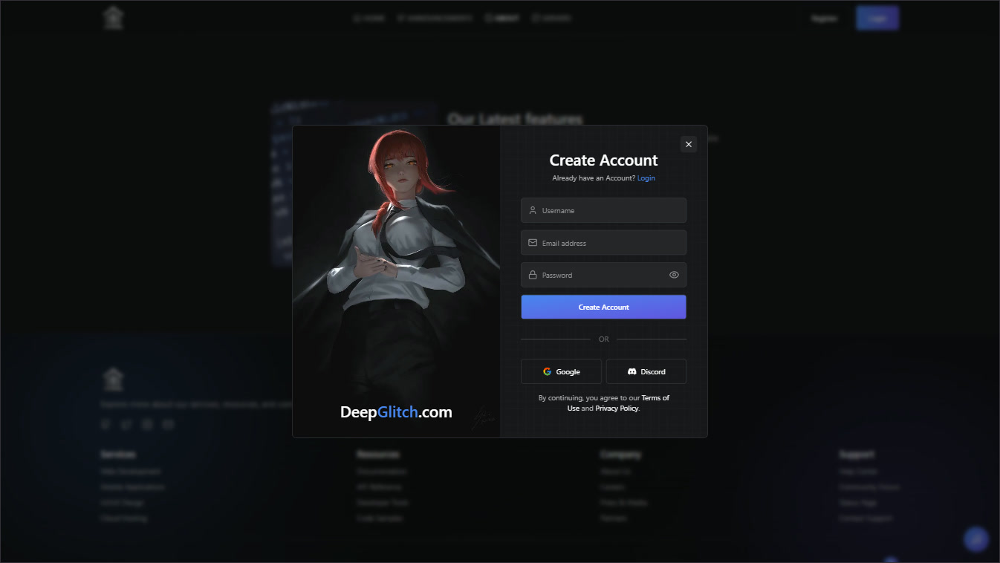
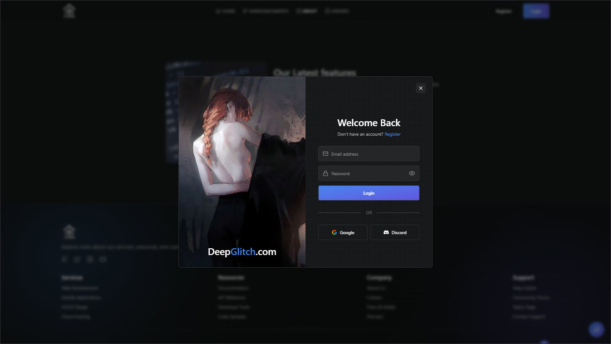
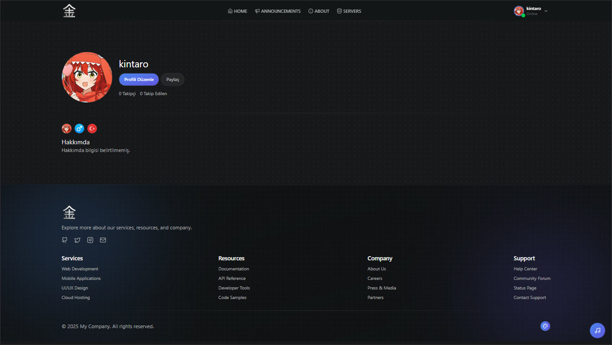
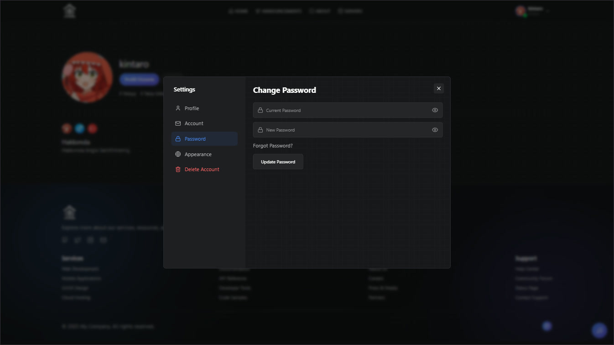

## 📋 About

**TR - TÜRKÇE**

Bu projede React, Node.js, Express ve MongoDB kullanarak kullanıcı kayıt, giriş ve profil sistemleri geliştirmeye çalıştım. Genel olarak hem backend hem de arayüz güzel oldu. Saklamak için buraya da yüklüyorum.

##

**EN - ENGLISH**

In this project, I tried building user registration, login, and profile systems using React, Node.js, Express, and MongoDB. Overall, both the backend and UI turned out pretty well. Uploading it here to keep it archived.

##

##

##

##

